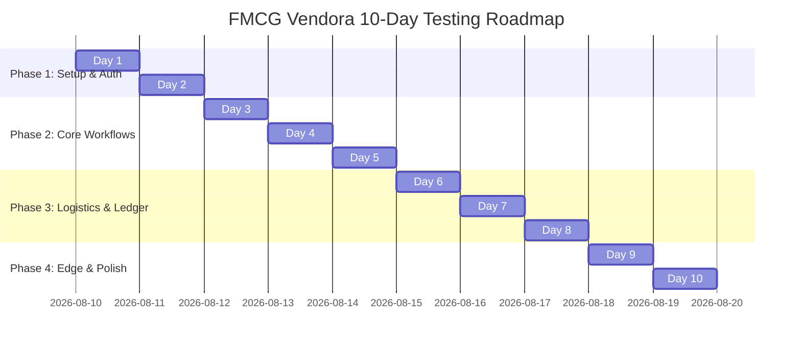

# 10-Day End-to-End System Testing Plan for FMCG Vendora

A structured day-by-day testing roadmap to validate all user roles (**Retailer**, **Distributor**, **Driver**, **Admin**), business workflows, credit limits, payment gateways, and system integrity.

---

## 📅 Testing Schedule Overview

---

## 📋 Day-by-Day Test Plan

### Day 1: System Setup, Environment & User Authentication
**Objective**: Ensure all servers (XAMPP, MySQL, Node/Vite) run smoothly and user onboarding/authentication functions for all roles.

- [ ] **DB Setup**: Verify database tables are initialized and migration `002_remove_online_credit.sql` is applied.
- [ ] **Retailer Onboarding**:
  - Register a new Retailer account with shop details (coordinates, city, shop name).
  - Test login with valid credentials (returns JWT token and stores session).
  - Test login with invalid password (expect error: `"Invalid credentials"`).
- [ ] **Distributor & Driver Auth**:
  - Test Distributor login and profile loading.
  - Test Driver login and registration under a specific distributor.
- [ ] **Role Protection**: Verify that a Retailer cannot access `/distributor` routes or Driver endpoints.

---

### Day 2: Catalog Management & Inventory Controls
**Objective**: Validate product setup, stock updates, pricing, and category filters.

- [ ] **Distributor Inventory**:
  - Add new products (Unit Price, Cost Price, Stock Quantity, Category).
  - Edit product details and update stock quantity.
  - Verify low stock warning threshold triggers correctly.
- [ ] **Retailer Catalog View**:
  - Log in as Retailer and browse Distributor product catalog.
  - Test category filter dropdown and search input.
  - Verify out-of-stock items show disabled "Out of Stock" state.

---

### Day 3: Retailer Order Placement & Credit Risk Gate
**Objective**: Test checkout methods (**Cash**, **Full Credit**, **Cash + Credit**) and credit limit enforcement.

- [ ] **Cash Checkout**: Place an order selecting **Full Cash on Delivery**. Verify order status is `Pending`.
- [ ] **Full Credit Checkout**:
  - Set a retailer credit limit of LKR 50,000 in Distributor portal.
  - Place an order worth LKR 30,000 using **Full Credit**.
  - Verify order is placed and available credit reduces to LKR 20,000.
- [ ] **Credit Risk Block (Over Limit)**:
  - Attempt placing an order worth LKR 25,000 (exceeds available LKR 20,000).
  - Expect credit gate error: `"Order total exceeds available credit"`.
- [ ] **Cash + Credit Split**:
  - Place a split payment order (e.g. LKR 10,000 Credit + LKR 15,000 Cash).
  - Verify cash and credit amounts are recorded accurately in DB.

---

### Day 4: Online Payment Gateway Integration
**Objective**: Test pre-paid online checkout via the sandbox Payment Gateway.

- [ ] **Online Order Initiation**:
  - Select **Online Payment** at checkout and click "Proceed to Online Gateway".
  - Verify Order is created with status `Pending` and payment_status `Pending_Gateway`.
- [ ] **Gateway Modal Simulation**:
  - Complete payment simulation with card details.
  - Verify signature hash calculation and callback handling.
  - Verify order payment_status updates to `Paid` and status updates to `Processing`.
  - Check in-app notification sent to both Retailer and Distributor.
- [ ] **Failed Payment Scenario**:
  - Simulate a payment failure in the gateway modal.
  - Verify order payment_status updates to `Failed`.

---

### Day 5: Order Management & 15-Minute Cancellation Lock Window
**Objective**: Test order lock window timers, order modifications, and distributor approval/rejection.

- [ ] **Retailer 15-Min Lock Window**:
  - Place a new pending order.
  - Verify countdown banner appears with 15-minute timer.
  - Test "Cancel Order" before timer expires (verify stock is restored and credit unlocked).
  - Test "Confirm Now" button to lock order early.
- [ ] **Expired Window Lock**:
  - Wait or simulate lock window expiration (>15 mins).
  - Verify "Cancel" button is disabled and backend returns HTTP 403 if cancellation is attempted.
- [ ] **Distributor Order Processing**:
  - Log in as Distributor, view new orders in Orders Table.
  - Test **Approve Order** (updates status to `Approved`).
  - Test **Reject Order** (notifies retailer and reverses credit allocations).

---

### Day 6: Delivery Dispatch & Driver Job Allocation
**Objective**: Verify dispatch creation, driver job claiming, and route planning.

- [ ] **Dispatch Assignment**:
  - Distributor creates a Delivery Batch for `Approved` orders.
  - Assign a specific Driver or mark as an open job pool item.
- [ ] **Driver Job Pool**:
  - Log in as Driver, view `Job Pool`.
  - Claim an available delivery job.
- [ ] **Driver My Route View**:
  - View assigned deliveries in `My Route` tab.
  - Verify order items, shop address, collectible cash amount, and payment status (`Cash`, `Credit`, or `Online (Prepaid)`).

---

### Day 7: Delivery Execution & Cash Collection
**Objective**: Test physical delivery completion, cash collection, and driver cash audit.

- [ ] **Delivery Completion**:
  - Driver marks delivery as **Delivered** at retailer location.
  - Record collected cash amount (Order cash portion + previous outstanding balance if applicable).
- [ ] **Failed Delivery Attempt**:
  - Test marking delivery as `Failed` / `Rejected` with reason.
  - Verify order status updates and notifications are dispatched.
- [ ] **Driver Cash Audit**:
  - Driver views total cash collected in `Cash Audit` page.
  - Verify cash total matches cash collected across all completed route stops.

---

### Day 8: Financial Ledger & Credit Settlement
**Objective**: Test credit account balancing, manual bank payments, and ledger history.

- [ ] **Distributor Payments Ledger**:
  - View retailer credit balances in Distributor `Payments` page.
  - Record a manual settlement payment via **Bank Transfer (`Bank`)** with deposit reference number.
- [ ] **Credit Balance Update**:
  - Verify retailer's `current_balance` decreases and `available_credit` increases.
  - Check transaction history log entries (`credit_transaction` table).
- [ ] **Account Blocking/Unblocking**:
  - Distributor blocks a retailer's credit account.
  - Verify Retailer cannot place any credit orders while account is blocked.
  - Distributor unblocks account and verifies normal checkout resumes.

---

### Day 9: Analytics, Reports & Pagination Verification
**Objective**: Verify real-time analytics data accuracy and UI pagination controls.

- [ ] **Distributor Analytics Dashboard**:
  - Verify Sales Overview chart, Revenue KPI cards, and Top Products table.
  - Check Payment Breakdown pie chart (`Cash`, `Credit`, `Cash + Credit`, `Online`, `Bank`).
- [ ] **Retailer Analytics Dashboard**:
  - Check Store Analytics summary and monthly spend breakdown.
- [ ] **Pagination Testing**:
  - Open Retailer **My Orders** page.
  - Verify table displays **10 rows per page**.
  - Test `Next`, `Previous`, `First`, `Last`, and direct page number buttons.
  - Test tab switching (All, Normal, Urgent, Delivered, Cancelled) and verify page resets to Page 1.

---

### Day 10: Security, Edge Cases & Performance Stress Test
**Objective**: Conduct final system security, edge case, and mobile responsiveness validation.

- [ ] **Unauthorized Access Tests**:
  - Attempt accessing protected API endpoints without a valid `Authorization: Bearer` header (expect 401 Unauthorized).
- [ ] **Concurrent Orders**:
  - Place multiple orders simultaneously from two retailer accounts to test database concurrency.
- [ ] **Mobile Responsiveness**:
  - Test Retailer and Driver portals on mobile screen widths (375px / 414px).
  - Verify tables scroll horizontally without breaking layout.
- [ ] **Final Sign-off**:
  - Review system logs (`XAMPP PHP error.log`) for zero unhandled warnings or fatal errors.

---

## 🎯 Summary Checklist

| Day | Focus Area | Status |
| :---: | :--- | :---: |
| **Day 1** | System Setup & Authentication | 🟩 Ready to Test |
| **Day 2** | Catalog & Stock Controls | 🟩 Ready to Test |
| **Day 3** | Retailer Checkout & Credit Gate | 🟩 Ready to Test |
| **Day 4** | Online Payment Gateway Sandbox | 🟩 Ready to Test |
| **Day 5** | Order Mgmt & 15-Min Lock Window | 🟩 Ready to Test |
| **Day 6** | Delivery Dispatch & Driver Route | 🟩 Ready to Test |
| **Day 7** | Delivery Execution & Cash Audit | 🟩 Ready to Test |
| **Day 8** | Credit Ledger & Bank Settlement | 🟩 Ready to Test |
| **Day 9** | Analytics & 10-Row Pagination | 🟩 Ready to Test |
| **Day 10**| Security, Edge Cases & Sign-off | 🟩 Ready to Test |
