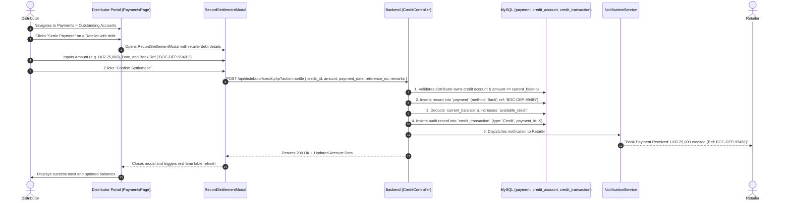

# FMCG Vendora — Distributor Bank Settlement & Credit Ledger Implementation Plan

Comprehensive technical specification and implementation architecture for **Distributor Manual Bank Settlement & Credit Ledger Reconciliation** across the **Vendora FMCG** platform.

---

## 1. Overview & Business Value

In the FMCG distribution industry, retailers frequently purchase goods on credit and later settle their accrued debt via **Direct Bank Deposit, Wire Transfer (EFT), or Cheque**. 

Once the distributor verifies the funds in their corporate bank account, they must record the settlement against the retailer's credit account using the **Bank Deposit Slip / Reference Number**.

```
Retailer makes Bank Transfer ──► Distributor verifies bank statement ──► Distributor records Settlement with Ref No ──► Retailer Debt Cleared & Credit Line Restored
```

### Key Capabilities
* **Debt Liquidation via Bank Transfers**: Allows distributors to record partial or full bank payments received from retailers.
* **Audit Trail Compliance**: Records bank slip / transaction reference numbers (`reference_no`) linked to the credit transaction history.
* **Instant Headroom Restoration**: Automatically updates the retailer's `current_balance` and restores `available_credit`.
* **Automated Notifications**: Informs the retailer immediately when their bank deposit has been acknowledged and posted to their ledger.

---

## 2. Current Status & Gap Analysis

| Component | Status | Details |
| :--- | :---: | :--- |
| **Database Schema** | ✅ Ready | `payment` table supports `payment_method = 'Bank'` and `reference_no`. `credit_transaction` supports `transaction_type = 'Credit'` with `balance_after`. |
| **Repository Math** | ✅ Ready | `CreditRepository::credit()` and `CreditRepository::addTransaction()` handle atomic ledger deductions. |
| **Backend API** | ❌ Missing | [CreditController.php](file:///c:/xampp/htdocs/fmcg-vendora/backend/controller/distributor/CreditController.php) lacks a `settle` action / endpoint to process manual distributor payments. |
| **Frontend UI** | ❌ Missing | [PaymentsPage.jsx](file:///c:/xampp/htdocs/fmcg-vendora/distributor-frontend/src/pages/PaymentsPage.jsx) / [OutstandingTable.jsx](file:///c:/xampp/htdocs/fmcg-vendora/distributor-frontend/src/components/payments/OutstandingTable.jsx) has no settlement modal or action button to enter bank references. |

---

## 3. End-to-End Architecture & Sequence Flow



---

## 4. Database & Ledger Data Modeling

### 1. `payment` Record
When the settlement is recorded, an entry is created in `payment`:
```sql
INSERT INTO payment (
    retailer_id,
    distributor_id,
    order_id,
    payment_date,
    amount,
    payment_method,
    reference_no,
    received_by
) VALUES (
    :retailer_id,
    :distributor_id,
    NULL,
    :payment_date,
    :amount,
    'Bank',
    :reference_no,
    :user_id
);
```

### 2. `credit_account` Balance Adjustment
```sql
UPDATE credit_account 
SET current_balance = GREATEST(0.00, current_balance - :amount),
    available_credit = LEAST(credit_limit, available_credit + :amount)
WHERE credit_id = :credit_id;
```

### 3. `credit_transaction` Audit Entry
```sql
INSERT INTO credit_transaction (
    credit_id,
    order_id,
    payment_id,
    transaction_type,
    amount,
    balance_after,
    description,
    created_by
) VALUES (
    :credit_id,
    NULL,
    :payment_id,
    'Credit',
    :amount,
    :balance_after,
    'Bank settlement deposit (Ref: BOC-DEP-99481)',
    :user_id
);
```

---

## 5. Backend Implementation Specifications

### A. Update `CreditController.php` (`backend/controller/distributor/CreditController.php`)

Add `settlePayment` method to handle `POST /api/distributor/credit.php?action=settle`:

```php
// In CreditController.php handle() match:
'POST' => match ($_GET['action'] ?? '') {
    'settle' => $this->settlePayment($distributorId, (int)$user['user_id']),
    default  => $this->createAccount($distributorId),
},
```

#### Implementation of `settlePayment`:
```php
private function settlePayment(int $distributorId, int $userId): void {
    $body = getBody();
    $creditId    = (int)($body['credit_id'] ?? 0);
    $amount      = (float)($body['amount'] ?? 0);
    $paymentDate = $body['payment_date'] ?? date('Y-m-d');
    $referenceNo = trim($body['reference_no'] ?? '');
    $remarks     = trim($body['remarks'] ?? 'Bank deposit settlement');

    if (!$creditId || $amount <= 0) {
        sendError('Valid credit_id and positive amount required', 400);
    }
    if (empty($referenceNo)) {
        sendError('Bank reference / deposit slip number is required', 400);
    }

    $credit = $this->creditRepo->findById($creditId);
    if (!$credit || (int)$credit['distributor_id'] !== $distributorId) {
        sendError('Credit account not found', 404);
    }

    $currentBalance = (float)$credit['current_balance'];
    if ($currentBalance <= 0) {
        sendError('Account has no outstanding debt to settle', 422);
    }
    if ($amount > $currentBalance) {
        sendError('Settlement amount exceeds current outstanding debt', 422);
    }

    $db = Database::getConnection();
    $db->beginTransaction();
    try {
        // 1. Create payment entry
        $stmt = $db->prepare("
            INSERT INTO payment (retailer_id, distributor_id, order_id, payment_date, amount, payment_method, reference_no, received_by)
            VALUES (?, ?, NULL, ?, ?, 'Bank', ?, ?)
        ");
        $stmt->execute([(int)$credit['retailer_id'], $distributorId, $paymentDate, $amount, $referenceNo, $userId]);
        $paymentId = (int)$db->lastInsertId();

        // 2. Reduce debt and restore credit headroom
        $this->creditRepo->credit($creditId, $amount);
        $updatedAccount = $this->creditRepo->findById($creditId);

        // 3. Log transaction audit record
        $this->creditRepo->addTransaction(
            $creditId,
            'Credit',
            $amount,
            (float)$updatedAccount['current_balance'],
            "Bank settlement (Ref: {$referenceNo})" . ($remarks ? " - {$remarks}" : ""),
            null,
            $paymentId,
            $userId
        );

        $db->commit();

        // 4. Send notification to retailer
        $retailerRepo = new RetailerRepository();
        $notifService = new NotificationService();
        $retailer = $retailerRepo->findById((int)$credit['retailer_id']);
        if ($retailer) {
            $notifService->send(
                $retailer['user_id'],
                "Bank Settlement Acknowledged",
                "Payment of LKR " . number_format($amount, 2) . " received via Bank Transfer (Ref: {$referenceNo}). Credit limit restored."
            );
        }

        sendSuccess($updatedAccount, 'Bank settlement recorded successfully');
    } catch (Exception $e) {
        $db->rollBack();
        sendError('Failed to process settlement: ' . $e->getMessage(), 500);
    }
}
```

---

## 6. Frontend Implementation Specifications

### A. New Component: `RecordSettlementModal.jsx`
Create `distributor-frontend/src/components/payments/RecordSettlementModal.jsx`:
* Displays retailer shop name, current outstanding debt, and credit limit.
* **Input Fields**:
  * **Settlement Amount (LKR)** (pre-filled with `outstanding`, with Quick-Fill "Pay Full" button).
  * **Payment Date** (default: today's date).
  * **Bank Slip / Deposit Reference Number** (e.g., `BOC-DEP-10829`).
  * **Remarks / Notes** (optional).
* Client-side validation:
  * Amount must be `> 0` and `< = current_balance`.
  * Reference number must not be empty.

### B. Update `OutstandingTable.jsx` (`distributor-frontend/src/components/payments/OutstandingTable.jsx`)
* Add a **"Settle Payment"** button in the Action column for accounts where `outstanding > 0`.
* Keep the existing **"View"** button for account inspection.

### C. Update `PaymentsPage.jsx` (`distributor-frontend/src/pages/PaymentsPage.jsx`)
* Import and render `<RecordSettlementModal />`.
* Attach `onSettle={(account) => setSelectedSettlementAccount(account)}`.
* On successful settlement:
  * Show success toast alert.
  * Trigger `fetchCredits()` and `fetchOrders()` to refresh data in real time.

---

## 7. Testing & Verification Checklist (Day 8 Alignment)

| Step | Test Action | Expected Result |
| :--- | :--- | :--- |
| **1** | Open Distributor Portal > **Payments & Credits** > **Outstanding Accounts** | Retailer shows accurate `Outstanding Balance` (e.g., LKR 50,000.00). |
| **2** | Click **Settle Payment** on an account with balance | `RecordSettlementModal` opens displaying exact balance and input fields. |
| **3** | Enter partial settlement (e.g., LKR 20,000.00) with Ref `COMM-SLIP-4401` | Submission succeeds; outstanding balance drops to LKR 30,000.00 and available credit increases by LKR 20,000.00. |
| **4** | Check `credit_transaction` & `payment` database tables | New records exist with `payment_method = 'Bank'`, `reference_no = 'COMM-SLIP-4401'`, and updated `balance_after`. |
| **5** | Log in as Retailer > Open **Credits** | Retailer sees reduced debt, increased available limit, and receives settlement notification. |
