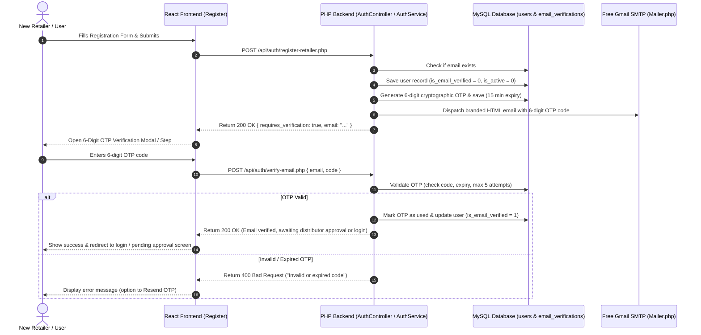
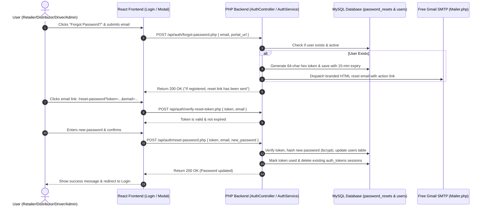

# FMCG Vendora — Auth Security & Email Verification Plan
## Registration Email OTP Verification + Forgot & Reset Password Flow

Comprehensive technical architecture and implementation guide to implement:
1. **Registration Email Verification (6-digit OTP code)** to guarantee user identity and deliverability.
2. **Secure Automated Forgot & Reset Password Workflow** across all Vendora portals (**Retailer**, **Distributor**, **Driver**, **Admin**).
3. **100% Free Resources Architecture** (Zero monthly cost, no custom domain needed).

---

## 1. End-to-End System Architectures

### A. Registration with 6-Digit Email OTP Verification



---

### B. Forgot & Reset Password Workflow



---

## 2. Free Resources Required (No Custom Domain Needed)

| Requirement | Solution | Cost | Domain Needed? | Limit |
| :--- | :--- | :--- | :--- | :--- |
| **Sender Email / SMTP** | **Gmail SMTP** (via 16-character Google App Password) | **FREE** | **No** (Uses `@gmail.com`) | ~500 emails/day |
| **Mail Transport** | **PHP Native TLS Sockets / PHPMailer** | **FREE** | **No** | Unlimited |
| **Email Verification** | 6-Digit OTP stored in MySQL | **FREE** | **No** | Unlimited |
| **Reset Password** | 64-Char Secure Token stored in MySQL | **FREE** | **No** | Unlimited |

---

## 3. How to Set Up the Sender Email (Google App Password)

You only need **1 Gmail address** to act as the automated sender for the entire FMCG platform:

1. Open your Google Account at **[myaccount.google.com](https://myaccount.google.com/)**.
2. Go to **Security** $\rightarrow$ Turn **2-Step Verification** **ON**.
3. Search for **"App Passwords"** (or visit **[myaccount.google.com/apppasswords](https://myaccount.google.com/apppasswords)**).
4. Enter `Vendora Backend` in the app name box and click **Create**.
5. Copy the generated **16-letter password** (e.g. `abcd efgh ijkl mnop`).
6. Configure in `backend/.env`:
   ```ini
   SMTP_HOST=smtp.gmail.com
   SMTP_PORT=587
   SMTP_USER=your-vendora-email@gmail.com
   SMTP_PASS=abcdefghijklmnop
   SMTP_FROM_NAME="Vendora FMCG"
   SMTP_FROM_EMAIL=your-vendora-email@gmail.com
   ```

---

## 4. Database Schema Migration

**File**: `backend/database/migrations/005_create_auth_email_verification_and_password_resets.sql`

```sql
-- 1. Add is_email_verified flag to users table
ALTER TABLE `users` 
ADD COLUMN `is_email_verified` TINYINT(1) NOT NULL DEFAULT 0 AFTER `is_active`;

-- 2. Create Email Verifications (OTP) table
CREATE TABLE IF NOT EXISTS `email_verifications` (
  `id` INT AUTO_INCREMENT PRIMARY KEY,
  `email` VARCHAR(100) NOT NULL,
  `code` VARCHAR(6) NOT NULL,
  `attempts` INT NOT NULL DEFAULT 0,
  `expires_at` DATETIME NOT NULL,
  `used` TINYINT(1) NOT NULL DEFAULT 0,
  `created_at` TIMESTAMP DEFAULT CURRENT_TIMESTAMP,
  INDEX `idx_verify_email` (`email`),
  INDEX `idx_verify_code` (`code`)
) ENGINE=InnoDB DEFAULT CHARSET=utf8mb4 COLLATE=utf8mb4_unicode_ci;

-- 3. Create Password Resets table
CREATE TABLE IF NOT EXISTS `password_resets` (
  `id` INT AUTO_INCREMENT PRIMARY KEY,
  `email` VARCHAR(100) NOT NULL,
  `token` VARCHAR(128) NOT NULL,
  `expires_at` DATETIME NOT NULL,
  `used` TINYINT(1) NOT NULL DEFAULT 0,
  `created_at` TIMESTAMP DEFAULT CURRENT_TIMESTAMP,
  INDEX `idx_reset_email` (`email`),
  INDEX `idx_reset_token` (`token`)
) ENGINE=InnoDB DEFAULT CHARSET=utf8mb4 COLLATE=utf8mb4_unicode_ci;
```

---

## 5. Backend Implementation (`backend/`)

### A. Environment Configuration (`backend/.env`)
```ini
; Mailer SMTP Configuration
SMTP_HOST=smtp.gmail.com
SMTP_PORT=587
SMTP_USER=your-email@gmail.com
SMTP_PASS=your-16-char-app-password
SMTP_FROM_NAME="Vendora FMCG"
SMTP_FROM_EMAIL=your-email@gmail.com

; Portal URLs for Links
FRONTEND_RETAILER_URL="http://localhost:5173"
FRONTEND_DISTRIBUTOR_URL="http://localhost:5174"
FRONTEND_DRIVER_URL="http://localhost:5175"
FRONTEND_ADMIN_URL="http://localhost:5176"
```

### B. Shared Mailer Utility (`backend/util/Mailer.php`)
* Establishes secure TLS SMTP connection.
* Supplies reusable, responsive HTML email templates with the Vendora Brand (Theme color: `#2446D8`, clean card layout, responsive typography).
* Templates included:
  1. **OTP Verification Email**: Large 6-digit code box, 15-min expiration warning, security disclaimer.
  2. **Password Reset Email**: Direct CTA button ("Reset Password"), fallback URL link, 15-min expiration warning.

### C. Repositories
1. **`backend/repository/EmailVerificationRepository.php`**:
   * `createOtp(string $email, string $code, string $expiresAt): bool`
   * `findLatestActiveOtp(string $email): ?array`
   * `incrementAttempts(int $id): void`
   * `markOtpAsUsed(int $id): bool`
   * `invalidatePreviousOtps(string $email): void`
2. **`backend/repository/PasswordResetRepository.php`**:
   * `createToken(string $email, string $token, string $expiresAt): bool`
   * `findValidToken(string $email, string $token): ?array`
   * `markTokenAsUsed(string $token): bool`
   * `deleteExpiredTokens(): void`
3. **`backend/repository/UserRepository.php`** (Extensions):
   * `setEmailVerified(int $userId): bool`
   * `updatePassword(int $userId, string $passwordHash): bool`

### D. Service Layer Updates (`backend/service/AuthService.php`)
* **Registration & Verification**:
  * `registerRetailer(...)`: Sets `is_email_verified = 0`, generates a secure 6-digit random code (`sprintf('%06d', random_int(100000, 999999))`), saves OTP with 15-min expiration, and dispatches the verification email.
  * `verifyEmailOtp(string $email, string $code)`: Validates code, enforces maximum 5 attempt rate-limit, marks OTP used, and sets `is_email_verified = 1`.
  * `resendVerificationOtp(string $email)`: Invalidates old codes, creates a fresh 6-digit OTP, and dispatches an email (with 60-second cooldown check).
* **Forgot & Reset Password**:
  * `forgotPassword(string $email, ?string $portalUrl)`: Generates 64-char token (`bin2hex(random_bytes(32))`), stores with 15-min expiry, sends reset email with portal link. Returns identical anti-enumeration success response.
  * `verifyResetToken(string $email, string $token)`: Validates existence, expiry, and non-used status.
  * `resetPassword(string $email, string $token, string $newPassword)`: Validates password complexity, updates bcrypt hash in `users`, marks token used, and clears `auth_tokens` for the user.

### E. API Endpoints
| Endpoint | Method | Payload | Purpose |
| :--- | :--- | :--- | :--- |
| `/api/auth/register-retailer.php` | `POST` | User & Profile Data | Registers retailer & sends 6-digit OTP |
| `/api/auth/verify-email.php` | `POST` | `{ "email": "...", "code": "123456" }` | Validates OTP & marks email verified |
| `/api/auth/resend-verification-otp.php`| `POST` | `{ "email": "..." }` | Sends fresh OTP code |
| `/api/auth/forgot-password.php` | `POST` | `{ "email": "...", "portal_url": "..." }` | Dispatches reset link email |
| `/api/auth/verify-reset-token.php` | `POST` | `{ "token": "...", "email": "..." }` | Pre-validates reset link on page load |
| `/api/auth/reset-password.php` | `POST` | `{ "token": "...", "email": "...", "password": "..." }` | Updates password & revokes old sessions |

---

## 6. Frontend Implementation (`retailer-frontend`, etc.)

### A. OTP Verification Modal (`src/components/auth/OtpVerificationModal.jsx`)
* Triggered immediately after submitting `RegisterStep2.jsx`.
* 6-box auto-focusing numeric input or single styled input.
* 60-second resend countdown timer.
* Displays success alert and directs user to login or pending approval notification.

### B. Forgot Password Modal (`src/components/auth/ForgotPasswordModal.jsx`)
* Replaces static alert on `Login.jsx` ("Forgot Password?").
* Captures user email, sends request to `/api/auth/forgot-password.php`.
* Displays clean confirmation state ("If registered, a reset link was sent").

### C. Reset Password Page (`src/pages/ResetPassword.jsx`)
* Route: `/reset-password?token=...&email=...`
* Automatically verifies token validity on mount (`useEffect`).
* Password strength validation & confirmation check.
* Show/hide password eye toggles.
* Submits reset request and redirects user to `/login`.

---

## 7. Security & Resilience Standards

1. **Cryptographic Randomness**:
   - OTP codes generated using `random_int(100000, 999999)`.
   - Reset tokens generated using `bin2hex(random_bytes(32))`.
2. **Brute-Force & Rate-Limiting**:
   - OTP codes locked after 5 failed attempts.
   - Resend cooldown enforced (60s minimum interval).
3. **Anti-Enumeration Protection**:
   - "Forgot Password" returns identical success response regardless of email existence to prevent user enumeration attacks.
4. **Immediate Session Invalidation**:
   - Resetting password invalidates all existing active tokens in `auth_tokens`.
5. **Short-Lived Expiry**:
   - Both OTP codes and Reset tokens strictly expire in **15 minutes**.
