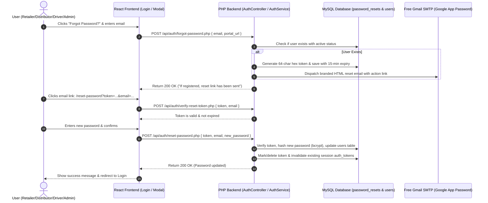

# FMCG Vendora — Forgot & Reset Password Implementation Plan

Comprehensive guide and technical architecture to implement a secure, automated **Forgot Password** and **Reset Password** workflow across the **Vendora FMCG** system using **100% free resources** (No custom domain required).

---

## 1. Architecture & Flow

This feature enables users across all portals (**Retailer**, **Distributor**, **Driver**, and **Admin**) to safely reset their credentials when forgotten.



---

## 2. Free Resources Required

| Requirement | Solution | Cost | Domain Needed? |
| :--- | :--- | :--- | :--- |
| **Sender Email / SMTP** | **Gmail SMTP** using a 16-character Google App Password | **FREE** (~500 emails/day) | **No** (Uses `@gmail.com`) |
| **Mail Library** | **PHPMailer** / PHP native TLS Sockets | **FREE** (Open-source) | **No** |
| **Local Testing** | Direct to `localhost:5173` / `localhost:5174` | **FREE** | **No** |
| **Database** | MySQL `password_resets` table | **FREE** (Included in existing DB) | **No** |

---

## 3. How to Set Up the Sender Email (Google App Password)

You only need **1 Gmail address** to act as the sender.

1. Open your Google Account at **[myaccount.google.com](https://myaccount.google.com/)**.
2. Go to **Security** $\rightarrow$ Ensure **2-Step Verification** is turned **ON**.
3. Search for **"App Passwords"** in the top bar (or navigate to **[myaccount.google.com/apppasswords](https://myaccount.google.com/apppasswords)**).
4. Enter `Vendora Backend` in the name field and click **Create**.
5. Copy the generated **16-letter password** (e.g. `abcd efgh ijkl mnop`).
6. Add it to `backend/.env`:
   ```ini
   SMTP_HOST=smtp.gmail.com
   SMTP_PORT=587
   SMTP_USER=your-vendora-email@gmail.com
   SMTP_PASS=abcdefghijklmnop
   SMTP_FROM_NAME="Vendora FMCG"
   SMTP_FROM_EMAIL=your-vendora-email@gmail.com
   ```

---

## 4. Database Schema Migration

File: `backend/database/migrations/010_create_password_resets_table.sql`

```sql
CREATE TABLE IF NOT EXISTS `password_resets` (
  `id` INT AUTO_INCREMENT PRIMARY KEY,
  `email` VARCHAR(100) NOT NULL,
  `token` VARCHAR(128) NOT NULL,
  `created_at` TIMESTAMP DEFAULT CURRENT_TIMESTAMP,
  `expires_at` DATETIME NOT NULL,
  `used` TINYINT(1) DEFAULT 0,
  INDEX `idx_reset_email` (`email`),
  INDEX `idx_reset_token` (`token`)
) ENGINE=InnoDB DEFAULT CHARSET=utf8mb4 COLLATE=utf8mb4_unicode_ci;
```

---

## 5. Backend Implementation Steps (`backend/`)

### A. Environment Configuration (`backend/.env`)
```ini
; Mailer Configuration
SMTP_HOST=smtp.gmail.com
SMTP_PORT=587
SMTP_USER=your-email@gmail.com
SMTP_PASS=your-16-char-app-password
SMTP_FROM_NAME="Vendora FMCG"
SMTP_FROM_EMAIL=your-email@gmail.com

; Portal URLs for Reset Links
FRONTEND_RETAILER_URL="http://localhost:5173"
FRONTEND_DISTRIBUTOR_URL="http://localhost:5174"
FRONTEND_DRIVER_URL="http://localhost:5175"
FRONTEND_ADMIN_URL="http://localhost:5176"
```

### B. Mailer Utility (`backend/util/Mailer.php`)
* Responsible for establishing an SMTP connection over TLS.
* Generates a modern HTML email with the Vendora FMCG theme (blue `#2446D8`, clean typography, action button, and 15-minute expiration warning).

### C. Repository Layer (`backend/repository/PasswordResetRepository.php`)
* `createToken(string $email, string $token, string $expiresAt): bool`
* `findValidToken(string $email, string $token): ?array`
* `markTokenAsUsed(string $token): bool`
* `deleteExpiredTokens(): void`

### D. User Repository Update (`backend/repository/UserRepository.php`)
* `updatePassword(int $userId, string $passwordHash): bool`

### E. Service Layer (`backend/service/AuthService.php`)
* **`forgotPassword(string $email, ?string $portalUrl)`**:
  * Verifies if user exists.
  * Generates a random 64-character token (`bin2hex(random_bytes(32))`).
  * Stores token with `NOW() + INTERVAL 15 MINUTE`.
  * Sends email with link: `{portalUrl}/reset-password?token={token}&email={email}`.
  * Always returns a generic success message to prevent account enumeration.
* **`verifyResetToken(string $email, string $token)`**:
  * Validates token existence, expiration, and unused status.
* **`resetPassword(string $email, string $token, string $newPassword)`**:
  * Validates new password length and complexity.
  * Generates bcrypt hash (`password_hash($newPassword, PASSWORD_BCRYPT)`).
  * Updates `users` table password.
  * Marks reset token as used.
  * Deletes all active sessions in `auth_tokens` for that `user_id` (forces fresh login across all devices).

### F. API Endpoints
1. `POST /backend/api/auth/forgot-password.php`
   * Request: `{ "email": "user@example.com", "portal_url": "http://localhost:5173" }`
   * Response: `{ "success": true, "message": "If this email is registered, a password reset link has been sent." }`
2. `POST /backend/api/auth/verify-reset-token.php`
   * Request: `{ "token": "...", "email": "..." }`
   * Response: `{ "success": true, "data": { "valid": true } }`
3. `POST /backend/api/auth/reset-password.php`
   * Request: `{ "token": "...", "email": "...", "password": "...", "confirm_password": "..." }`
   * Response: `{ "success": true, "message": "Password reset successfully. Please login with your new password." }`

---

## 6. Frontend Implementation Steps (`retailer-frontend`, `distributor-frontend`, etc.)

### A. Forgot Password Modal (`src/components/auth/ForgotPasswordModal.jsx`)
* Replaces placeholder `alert()` in `Login.jsx`.
* Allows user to submit email with instant client-side validation.
* Shows loading spinner $\rightarrow$ Success confirmation message.

### B. Reset Password Page (`src/pages/ResetPassword.jsx`)
* Route: `/reset-password?token=...&email=...`
* Automatically reads `token` and `email` query parameters.
* Validates token on component mount.
* Displays New Password and Confirm Password inputs with show/hide password toggles.
* Submits reset request and redirects user to `/login` upon success.

### C. Routing & Login Updates
* Update `App.jsx` with `<Route path="/reset-password" element={<ResetPassword />} />`.
* Update `Login.jsx` to open the `ForgotPasswordModal`.

---

## 7. Security Best Practices Included

1. **Short-Lived Expiration**: Tokens expire automatically after **15 minutes**.
2. **One-Time Use**: Tokens are invalidated immediately upon first successful reset.
3. **Anti-Enumeration Protection**: Endpoint returns an identical success message regardless of whether the email is registered or not.
4. **Session Revocation**: Existing active tokens in `auth_tokens` are deleted so compromised sessions are immediately revoked.
5. **Secure Cryptography**: Tokens generated using `random_bytes(32)` and passwords hashed using `PASSWORD_BCRYPT`.
