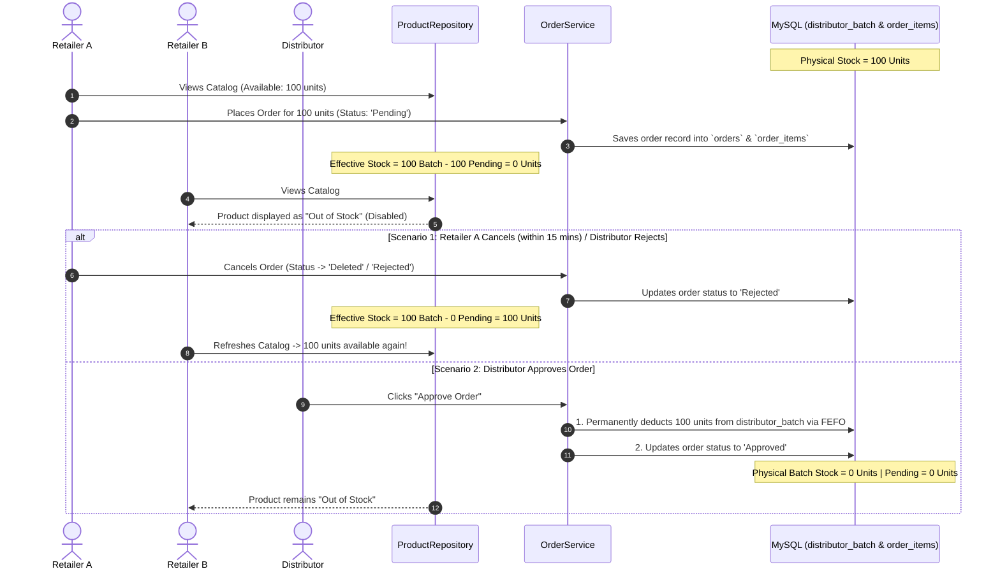

# FMCG Vendora — Dynamic Soft Stock Reservation Implementation Plan

Comprehensive architectural specification and technical implementation plan for **Dynamic Soft Stock Reservation & Overselling Prevention** across the **Vendora FMCG** ordering lifecycle.

---

## 1. Executive Summary & Problem Statement

### The Problem
Currently in Vendora, inventory is only permanently deducted from `distributor_batch` when a distributor explicitly **approves** an order. 

While an order sits in **`Pending`** (during the 15-minute retailer modification window) or **`Processing`**, `distributor_batch.quantity` remains unadjusted in the database. Consequently, other retailers browsing the catalog continue to see those units as available and can submit duplicate orders for the same physical stock, creating overselling conflicts for distributors.

### The Solution: Dynamic Soft Stock Reservation
Implement a **Zero-Migration Soft Reservation Engine** where available catalog stock is computed dynamically:

$$\text{Effective Available Stock} = \max\left(0, \sum \text{Active Batch Stock} - \sum \text{Pending/Processing Orders}\right)$$

* **Instant Commitment**: As soon as Retailer A places an order, the ordered units are immediately subtracted from catalog visibility for all other retailers.
* **Instant Automatic Release**: If Retailer A cancels within 15 minutes or the distributor rejects the order, the reserved units instantly reappear in the catalog without requiring complex batch rollback queries.
* **Permanent FEFO Deduction**: When the distributor approves the order, the units are permanently deducted from `distributor_batch` using FEFO (First-Expiring, First-Out).

---

## 2. End-to-End Sequence & State Machine



---

## 3. Technical Changes Required

### Layer 1: Product Repository (`backend/repository/ProductRepository.php`)

#### A. Update `getCatalogForDistributor()`
Modify the query to dynamically deduct unapproved pending/processing orders from the active batch sum:

```php
public function getCatalogForDistributor(int $distributorId, int $categoryId = 0): array {
    $sql = "SELECT p.*, pc.category_name,
                   GREATEST(0,
                       COALESCE((
                           SELECT SUM(db.quantity) 
                           FROM distributor_batch db 
                           WHERE db.product_id = p.product_id 
                             AND db.distributor_id = ? 
                             AND db.status = 'Active'
                       ), 0)
                       -
                       COALESCE((
                           SELECT SUM(oi.quantity) 
                           FROM order_items oi 
                           JOIN orders o ON o.order_id = oi.order_id 
                           WHERE oi.product_id = p.product_id 
                             AND o.distributor_id = ? 
                             AND o.status IN ('Pending', 'Processing')
                       ), 0)
                   ) AS available_qty,
                   MIN(db.selling_price) AS unit_price
            FROM product p
            JOIN product_category pc ON pc.category_id = p.category_id
            JOIN distributor_batch db ON db.product_id = p.product_id
              AND db.distributor_id = ? AND db.status = 'Active'
            WHERE p.status = 'Active'
            GROUP BY p.product_id, pc.category_name
            HAVING available_qty > 0";
    
    $params = [$distributorId, $distributorId, $distributorId];
    if ($categoryId > 0) { 
        $sql .= " AND p.category_id = ?"; 
        $params[] = $categoryId; 
    }
    $sql .= " ORDER BY p.product_name";
    
    $stmt = $this->db->prepare($sql);
    $stmt->execute($params);
    return $stmt->fetchAll();
}
```

#### B. Update `getProductsForDistributor()`
Provide distributors with full visibility of **Physical Stock**, **Reserved (Committed) Stock**, and **Net Available Stock**:

```php
public function getProductsForDistributor(int $distributorId): array {
    $sql = "SELECT
                p.product_id,
                p.product_name,
                p.description,
                p.unit,
                p.image_url,
                p.status AS product_status,
                pc.category_name,
                pc.category_id,
                pp.base_price,
                pp.mrp_max_retail_price AS mrp,
                COALESCE((
                    SELECT MIN(db.selling_price) 
                    FROM distributor_batch db 
                    WHERE db.product_id = p.product_id AND db.distributor_id = ? AND db.status = 'Active'
                ), pp.base_price) AS selling_price,
                -- Total Physical Batch Stock
                COALESCE((
                    SELECT SUM(db.quantity) 
                    FROM distributor_batch db 
                    WHERE db.product_id = p.product_id AND db.distributor_id = ? AND db.status = 'Active'
                ), 0) AS physical_stock,
                -- Reserved Stock in Pending Orders
                COALESCE((
                    SELECT SUM(oi.quantity)
                    FROM order_items oi
                    JOIN orders o ON o.order_id = oi.order_id
                    WHERE oi.product_id = p.product_id AND o.distributor_id = ? AND o.status IN ('Pending', 'Processing')
                ), 0) AS reserved_stock,
                -- Net Available Headroom
                GREATEST(0,
                    COALESCE((SELECT SUM(db.quantity) FROM distributor_batch db WHERE db.product_id = p.product_id AND db.distributor_id = ? AND db.status = 'Active'), 0)
                    -
                    COALESCE((SELECT SUM(oi.quantity) FROM order_items oi JOIN orders o ON o.order_id = oi.order_id WHERE oi.product_id = p.product_id AND o.distributor_id = ? AND o.status IN ('Pending', 'Processing')), 0)
                ) AS stock
            FROM product p
            JOIN product_category pc ON pc.category_id = p.category_id
            LEFT JOIN product_pricing pp ON pp.product_id = p.product_id AND pp.effective_to IS NULL
            WHERE p.status = 'Active'
            ORDER BY p.product_name";

    $stmt = $this->db->prepare($sql);
    $stmt->execute([$distributorId, $distributorId, $distributorId, $distributorId, $distributorId]);
    return $stmt->fetchAll();
}
```

---

### Layer 2: Order Service (`backend/service/OrderService.php`)

#### A. Pre-Checkout Validation
In `OrderService::placeOrder()`, `getCatalogForDistributor()` will now automatically return the net `available_qty`. If multiple requests arrive concurrently, the gate strictly enforces stock limits:

```php
if ($product['available_qty'] < $item['quantity']) {
    throw new Exception("Insufficient available stock for: {$product['product_name']}. Only {$product['available_qty']} units currently available.", 422);
}
```

#### B. Order Modifications in the 15-Minute Window
In `OrderService::modifyOrder()`, exclude the current order's existing items when calculating available stock so the retailer can modify quantities without competing with their own reservation:

```php
// Net Available for modification = Batch Stock - (Other Pending Orders)
```

---

## 4. Edge Cases & Resilience Analysis

| Edge Case | Risk | Mitigation Strategy |
| :--- | :--- | :--- |
| **High-concurrency Checkout** | Two retailers checkout the last 10 units at the exact same second. | Wrap `placeOrder` in a database transaction with table/row locking (`SELECT ... FOR UPDATE`), ensuring serial execution. |
| **Retailer Abandons/Cancels Order** | Stock stays locked indefinitely. | The 15-minute countdown window automatically transitions abandoned orders or allows instant cancellation, restoring available stock immediately. |
| **Distributor Rejects Order** | Reserved stock is lost. | Rejection updates order status to `Rejected`, instantly excluding it from the `Pending/Processing` sum and restoring catalog stock. |
| **Batch Expiration During Pending Window** | Order is placed on a batch that expires before approval. | `markExpiredDistributorBatches()` runs on read, and FEFO deduction in `approveOrder` validates active expiration before debiting. |

---

## 5. Verification & Testing Plan

### Automated / Manual Test Scenarios

| Scenario | Action | Expected Outcome |
| :--- | :--- | :--- |
| **Test 1: Full Stock Reservation** | Product X has 50 units in batch. Retailer 1 orders all 50 units. | Order status = `Pending`. Retailer 2 opens catalog and sees Product X as "Out of Stock" (disabled). |
| **Test 2: Partial Stock Reservation** | Product X has 50 units. Retailer 1 orders 20 units. | Retailer 2 opens catalog and sees exactly 30 units available. |
| **Test 3: Order Cancellation** | Retailer 1 cancels their 20-unit order within the 15-min window. | Retailer 2 refreshes catalog and sees full 50 units available again. |
| **Test 4: Distributor Rejection** | Retailer 1 orders 20 units. Distributor rejects the order with remarks. | Retailer 2 refreshes catalog and sees 50 units available. |
| **Test 5: Distributor Approval** | Retailer 1 orders 20 units. Distributor approves the order. | 20 units are permanently deducted from `distributor_batch` via FEFO. Physical stock becomes 30. Retailer 2 sees 30 units available. |
