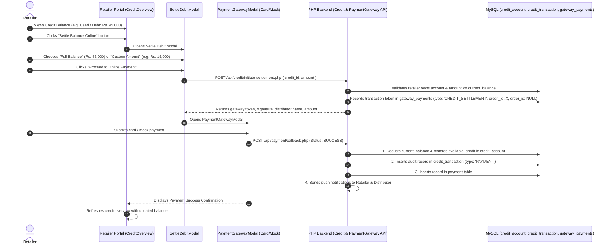

# FMCG Vendora — Online Debit Settlement Implementation Plan

Comprehensive guide and technical architecture to implement an **Online Debt / Credit Settlement** feature for retailers across the **Vendora FMCG** system.

---

## 1. Overview & Business Value

Currently, retailers accumulate debt on their credit accounts when placing credit orders, which is traditionally settled on subsequent orders or cash collection. 

This feature allows retailers to **settle their outstanding credit balance (full or partial) directly online at any time** using the integrated payment gateway (Credit/Debit Card, Sandbox Mock Gateway).

### Key Benefits
* **Accelerates Cash Flow**: Distributors receive payments faster without waiting for subsequent physical deliveries.
* **Instant Credit Line Restoration**: Retailers hitting their credit limit can instantly pay off debt online and unlock purchasing power for urgent stock replenishment.
* **Zero Impact on Existing Orders**: 100% backward compatible with normal order checkout.

---

## 2. End-to-End Architecture & Sequence Flow



---

## 3. Database Migration

File: `backend/database/migrations/011_alter_gateway_payments_for_credit_settlement.sql`

```sql
-- ============================================================
-- Migration: Support Credit / Debit Settlement in Gateway Payments
-- ============================================================

-- 1. Allow order_id to be NULL for standalone debit settlements
ALTER TABLE `gateway_payments` MODIFY `order_id` INT(11) NULL;

-- 2. Add credit_id and payment_type columns
ALTER TABLE `gateway_payments` 
  ADD COLUMN `credit_id` INT(11) NULL AFTER `order_id`,
  ADD COLUMN `payment_type` ENUM('ORDER', 'CREDIT_SETTLEMENT') NOT NULL DEFAULT 'ORDER' AFTER `distributor_id`,
  ADD KEY `idx_gw_credit` (`credit_id`),
  ADD CONSTRAINT `fk_gw_credit` FOREIGN KEY (`credit_id`) REFERENCES `credit_account` (`credit_id`) ON DELETE CASCADE;
```

---

## 4. Backend Implementation Steps (`backend/`)

### A. Update Gateway Payment Repository (`backend/repository/GatewayPaymentRepository.php`)
Add a dedicated method for credit settlement records:
```php
public function createSettlement(int $creditId, int $retailerId, int $distributorId, float $amount, string $token, string $signature, string $gatewayName = 'Vendora Mock Gateway'): int {
    $stmt = $this->db->prepare("
        INSERT INTO gateway_payments 
        (order_id, credit_id, retailer_id, distributor_id, payment_type, amount, currency, gateway_name, transaction_token, status, signature)
        VALUES (NULL, ?, ?, ?, 'CREDIT_SETTLEMENT', ?, 'LKR', ?, ?, 'INITIATED', ?)
    ");
    $stmt->execute([$creditId, $retailerId, $distributorId, $amount, $gatewayName, $token, $signature]);
    return (int)$this->db->lastInsertId();
}
```

### B. Update Payment Gateway Service (`backend/service/PaymentGatewayService.php`)
1. **Add `initiateCreditSettlement(int $retailerId, int $creditId, float $amount)`**:
   - Validates that the credit account exists and belongs to the authenticated retailer.
   - Validates `$amount > 0` and `$amount <= (float)$account['current_balance']`.
   - Generates token and cryptographic signature.
   - Saves record via `gwRepo->createSettlement(...)`.
   - Returns transaction payload for frontend modal.

2. **Update `processCallback(...)`**:
   - Checks `payment_type` of the gateway transaction:
   ```php
   if ($gwRecord['payment_type'] === 'CREDIT_SETTLEMENT') {
       $creditId = (int)$gwRecord['credit_id'];
       
       // 1. Credit the account (reduces balance & increases available limit)
       $this->creditRepo->credit($creditId, $amount);
       
       // 2. Add audit trail in credit_transaction
       $account = $this->creditRepo->findById($creditId);
       $retailer = $this->retailerRepo->findById((int)$gwRecord['retailer_id']);
       $userId = $retailer ? (int)$retailer['user_id'] : 1;
       
       $this->creditRepo->addTransaction(
           $creditId,
           'PAYMENT',
           $amount,
           (float)$account['current_balance'],
           "Online Debit Settlement (Ref: " . ($gatewayRef ?: $token) . ")",
           null,
           null,
           $userId
       );
       
       // 3. Send notifications
       $distributor = $this->distributorRepo->findById((int)$gwRecord['distributor_id']);
       if ($distributor) {
           $this->notifService->send($distributor['user_id'], "Credit Settlement Received", "Retailer '{$retailer['shop_name']}' paid LKR " . number_format($amount, 2) . " online.");
       }
       if ($retailer) {
           $this->notifService->send($retailer['user_id'], "Credit Payment Confirmed", "Your online payment of LKR " . number_format($amount, 2) . " was processed.");
       }
   } else {
       // Standard Order Payment Flow (Existing Logic)
       $this->orderRepo->updatePaymentStatus($orderId, 'Paid');
       $this->orderRepo->updateStatus($orderId, 'Processing');
       $this->orderRepo->recordPayment(...);
   }
   ```

### C. Create API Endpoint (`backend/api/credit/initiate-settlement.php`)
* **Endpoint**: `POST /backend/api/credit/initiate-settlement.php`
* **Headers**: `Authorization: Bearer <TOKEN>`
* **Request Body**:
  ```json
  {
    "credit_id": 3,
    "amount": 15000.00
  }
  ```
* **Response**:
  ```json
  {
    "success": true,
    "data": {
      "gateway_payment_id": 42,
      "credit_id": 3,
      "amount": 15000.00,
      "currency": "LKR",
      "transaction_token": "a1b2c3d4...",
      "signature": "e5f6g7...",
      "shop_name": "Sunrise Mart",
      "distributor_name": "Nestle Lanka PLC"
    }
  }
  ```

---

## 5. Frontend Implementation Steps (`retailer-frontend`)

### A. Settle Debit Modal Component (`src/components/Credits/SettleDebitModal.jsx`)
* Modal interface allowing the retailer to:
  * View current outstanding balance with the selected distributor.
  * Choose between:
    * **Full Settlement**: Pre-fills the exact `current_balance`.
    * **Partial Settlement**: Input field with live validation (min: `Rs. 100`, max: `current_balance`).
  * Displays a summary breakdown before opening the gateway modal.

### B. Update Credit Overview Card (`src/components/Credits/CreditOverview.jsx`)
* Add a primary **"Settle Debt Online"** button with a credit card icon.
* Automatically passes the active distributor's `credit_id` and `current_balance`.
* If `used === 0`, the button is disabled or displays `"No Outstanding Debt"`.

### C. Service Integration (`src/services/orderService.js` / `creditService.js`)
Add service function:
```javascript
export async function initiateCreditSettlement(token, creditId, amount) {
  const res = await fetch("http://localhost/fmcg-vendora/backend/api/credit/initiate-settlement.php", {
    method: "POST",
    headers: {
      "Content-Type": "application/json",
      "Authorization": `Bearer ${token}`
    },
    body: JSON.stringify({ credit_id: creditId, amount: Number(amount) })
  });
  return res.json();
}
```

---

## 6. Verification & Testing Checklist

1. **Safety Verification**:
   * Run standard order placement with Cash, Credit, and Online payment to confirm zero regression.
2. **Partial Settlement**:
   * Settle `Rs. 5,000` out of a `Rs. 20,000` debt $\rightarrow$ verify balance becomes `Rs. 15,000` and available limit increases by `Rs. 5,000`.
3. **Full Settlement**:
   * Settle remaining `Rs. 15,000` $\rightarrow$ verify balance drops to `Rs. 0` and available limit matches the total credit limit.
4. **Audit History**:
   * Check `credit_transaction` table to ensure every settlement has a distinct timestamp, amount, and reference code.
