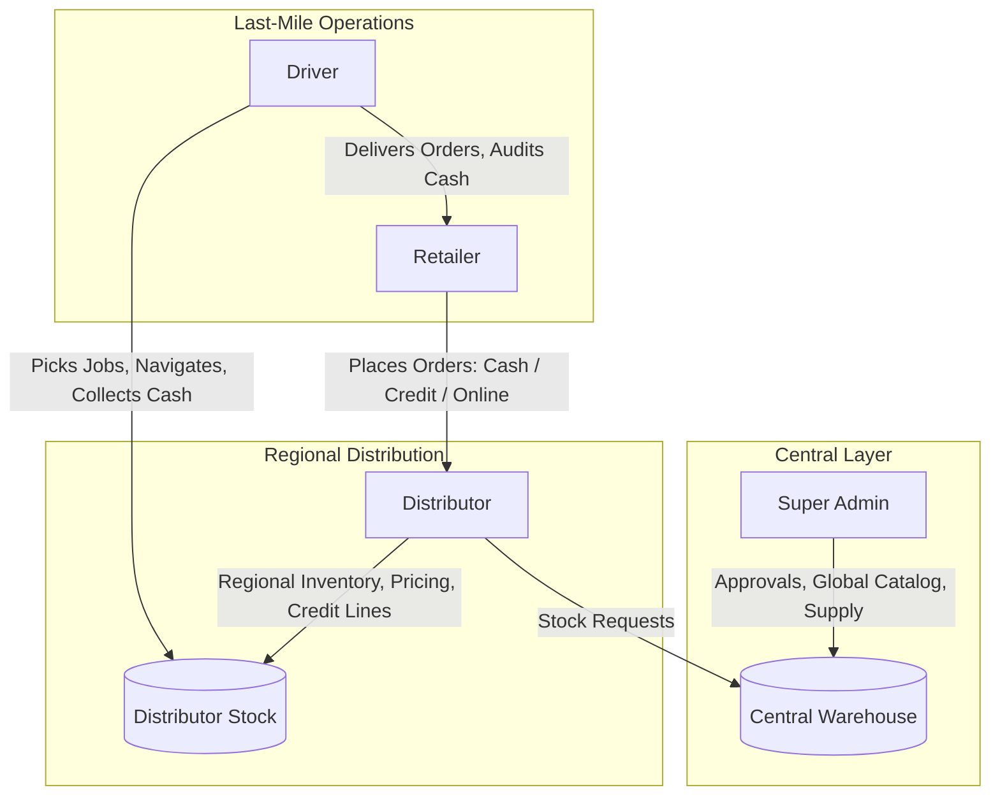

# FMCG Vendora — System Modules Specification

Comprehensive architectural breakdown of all core functional modules, user roles, business workflows, and technical components across the **Vendora FMCG** platform.

---

## 1. System Overview & Architecture

**FMCG Vendora** is a multi-tier B2B supply chain management and automated distribution platform connecting **Central FMCG Manufacturers/Super Admins**, **Regional Distributors**, **Retail Store Owners**, and **Logistics Drivers**.

---

## 2. User Roles Matrix

| Role | Role Code | Primary Responsibilities | Access Scope |
| :--- | :--- | :--- | :--- |
| **Super Admin** | `SUPER_ADMIN` | Platform governance, user approvals, global product catalog, supply request approvals, central warehouse inventory. | System-wide (`/admin-frontend`, `/api/admin/`) |
| **Distributor** | `DISTRIBUTOR` | Regional warehouse inventory, retailer order approvals, credit line limits, delivery dispatch, bank settlements, regional analytics. | Regional (`/distributor-frontend`, `/api/distributor/`) |
| **Retailer** | `RETAILER` | Product catalog browsing, cart checkout (Cash, Credit, Split, Online), 15-minute order modification, online debt settlement, delivery tracking. | Shop-specific (`/retailer-frontend`, `/api/retailer/`) |
| **Driver** | `DRIVER` | Delivery job pool claiming, GPS route navigation, store delivery execution, cash on delivery collection, shift cash audit. | Fleet-specific (`/driver-frontend`, `/api/driver/`) |

---

## 3. Detailed Module Specifications

### Module 1: User Authentication & Access Control (RBAC)
* **Objective**: Provides secure onboarding, authentication, role isolation, and session security across all portals.
* **Key Features**:
  * Multi-role registration (e.g., Retailers register with shop geolocation coordinates and business details).
  * JWT / DB token-based authentication with 24-hour expiration stored in `auth_tokens`.
  * Role-Based Access Control (`requireRole()` middleware enforcing endpoint security).
  * Email verification and OTP / Token-based Forgot Password recovery flow.
* **Database Tables**: `users`, `roles`, `auth_tokens`, `password_resets`, `email_verifications`.
* **Backend Components**: `AuthController.php`, `AuthService.php`, `UserRepository.php`, `TokenRepository.php`.
* **Frontend Components**: `Login.jsx`, `Register.jsx`, `ForgotPasswordModal.jsx`, `ResetPassword.jsx`.

---

### Module 2: Product & Inventory Management
* **Objective**: Governs product catalogs, categories, regional pricing, and multi-batch warehouse stock.
* **Key Features**:
  * Central product catalog creation, categorization, and image management.
  * Distributor batch inventory tracking (`distributor_batch`) with batch numbers and expiration dates.
  * Automated low-stock threshold monitoring and visual alerts.
  * Real-time stock status indicator (In Stock vs. Out of Stock) disabling purchase of depleted products.
* **Database Tables**: `product`, `product_category`, `product_pricing`, `warehouse_batch`, `distributor_batch`.
* **Backend Components**: `ProductController.php`, `ProductRepository.php`, `StockRepository.php`.
* **Frontend Components**: `ProductsPage.jsx`, `MyInventoryPage.jsx`, `Products.jsx`, `RequestStockPage.jsx`.

---

### Module 3: B2B Order Placement & Credit Risk Gate
* **Objective**: Handles retail shopping carts, multi-term checkouts, and automated credit risk validation.
* **Key Features**:
  * Flexible checkout terms: **Cash on Delivery (COD)**, **Full Credit**, **Split Payment (Cash + Credit)**, and **Online Prepaid**.
  * **Automated Credit Risk Gate**: Evaluates `available_credit` in real time and blocks checkout if the order exceeds credit limits or if the retailer's account is blocked.
  * **15-Minute Cancellation Lock Window**: Retailers can modify or cancel pending orders within 15 minutes before the order locks for distributor fulfillment.
* **Database Tables**: `orders`, `order_items`, `credit_account`.
* **Backend Components**: `OrderController.php`, `OrderService.php`, `OrderRepository.php`.
* **Frontend Components**: `Cart.jsx`, `Payment.jsx`, `MyOrders.jsx`.

---

### Module 4: Online Payment Gateway & Digital Settlement
* **Objective**: Enables instantaneous digital payments for order pre-payments and full outstanding debt liquidation.
* **Key Features**:
  * Integrated payment gateway modal with HMAC-SHA256 signature verification.
  * Pre-paid order checkout updating order status to `Paid` and `Processing`.
  * **Full Online Debt Settlement**: Retailers can settle 100% of accumulated debt online at any time, instantly restoring their credit limit.
  * Direct payment transaction audit logging in `gateway_payments` and `payment`.
* **Database Tables**: `gateway_payments`, `payment`, `credit_account`, `credit_transaction`.
* **Backend Components**: `GatewayController.php`, `PaymentGatewayService.php`, `PaymentGateway.php`.
* **Frontend Components**: `PaymentGatewayModal.jsx`, `SettleDebitModal.jsx`, `CreditOverview.jsx`.

---

### Module 5: Distributor Order Processing & Dispatch
* **Objective**: Enables regional distributors to manage incoming retail orders, process fulfillment, and create delivery dispatches.
* **Key Features**:
  * Live order management dashboard with status filtering (Pending, Processing, Approved, Delivered, Rejected).
  * Order approval/rejection with automatic credit reservation rollback.
  * Batch delivery job generation pushing ready orders into the open driver pool.
* **Database Tables**: `orders`, `order_items`, `delivery`, `retailer`.
* **Backend Components**: `OrderController.php`, `DeliveryController.php`, `DeliveryRepository.php`.
* **Frontend Components**: `OrdersPage.jsx`, `OrderHistoryPage.jsx`, `DeliveryPage.jsx`.

---

### Module 6: Central Warehouse Supply Requests & Stock Transfer
* **Objective**: Connects regional distributors to the central manufacturer warehouse for automated stock replenishment.
* **Key Features**:
  * Distributors generate bulk stock supply requests (`supply_request`) with required item quantities.
  * Super Admin reviews, approves, or rejects supply requests.
  * Atomic stock transfer (`stock_transfer`): Deducts inventory from central warehouse and increments distributor batch stock.
* **Database Tables**: `supply_request`, `supply_request_items`, `stock_transfer`, `stock_transfer_items`.
* **Backend Components**: `SupplyController.php`, `SupplyService.php`, `SupplyRepository.php`.
* **Frontend Components**: `RequestStockPage.jsx`, `WarehouseStockController.php`.

---

### Module 7: Driver Delivery Execution & Route Navigation
* **Objective**: Facilitates driver dispatch, atomic job claiming, interactive map navigation, and physical delivery completion.
* **Key Features**:
  * Open Delivery Job Pool with atomic row-locking (`SELECT FOR UPDATE`) to prevent race conditions.
  * Interactive **Leaflet GPS Map** plotting shop locations and delivery stops.
  * Delivery completion workflow (`Delivered` vs `Returned/Failed`).
  * **Automated Stock Deduction**: Automatically deducts batch quantities from distributor inventory upon delivery completion.
  * **Driver Cash Audit**: Real-time aggregation of physical cash collected across all completed route stops.
* **Database Tables**: `delivery`, `orders`, `retailer`, `driver`, `distributor_batch`.
* **Backend Components**: `DeliveryController.php`, `DeliveryService.php`, `DeliveryRepository.php`.
* **Frontend Components**: `JobPool.jsx`, `MyRoute.jsx`, `CashAudit.jsx`, `Dashboard.jsx`.

---

### Module 8: Credit Ledger & Financial Reconciliation
* **Objective**: Manages B2B revolving credit lines, double-entry ledger tracking, and debt settlement reconciliation.
* **Key Features**:
  * Retailer credit account tracking (`credit_limit`, `current_balance`, `available_credit`).
  * **Double-Entry Transaction Audit Log** (`credit_transaction` records Debits, Credits, Adjustments, and `balance_after`).
  * **Manual Bank Settlement**: Distributors record bank wire transfers / deposit slips (`payment_method = 'Bank'`) with reference numbers.
  * **Delivery Cash Settlement**: Excess cash collected on delivery is automatically credited toward past credit debt.
  * Risk controls: Account blocking/unblocking for delinquent retailers.
* **Database Tables**: `credit_account`, `credit_transaction`, `payment`.
* **Backend Components**: `CreditController.php`, `CreditRepository.php`, `DeliveryService.php`.
* **Frontend Components**: `PaymentsPage.jsx`, `OutstandingTable.jsx`, `PaymentsTable.jsx`, `Credits.jsx`.

---

### Module 9: Analytics, Reporting & Real-Time Notifications *(Supplementary)*
* **Objective**: Provides business intelligence, real-time KPI metrics, and push alerts across all workflows.
* **Key Features**:
  * Real-time in-app notification system with unread badges.
  * Distributor analytics: Revenue KPI cards, sales trends, top-selling products, and payment breakdown charts.
  * Retailer analytics: Monthly spending patterns, order velocity, and credit utilization charts.
* **Database Tables**: `notification`, `orders`, `payment`, `credit_account`.
* **Backend Components**: `NotificationService.php`, `NotificationRepository.php`, `notifications.php`.
* **Frontend Components**: `AnalyticsPage.jsx`, `DashboardPage.jsx`, `Analytics.jsx`, `NotificationBell.jsx`.

---

## 4. Summary Matrix of System Modules

| # | Module Name | Target Users | Primary Output / Artifact |
| :---: | :--- | :--- | :--- |
| **M1** | User Authentication & Access Control | All Roles | JWT/DB Session Tokens, RBAC Security |
| **M2** | Product & Inventory Management | Admin, Distributor, Retailer | Product Catalog, Batch Stock Tracking |
| **M3** | B2B Order Placement & Credit Risk Gate | Retailer | Orders, Credit Limit Deductions |
| **M4** | Online Payment Gateway & Settlement | Retailer, Distributor | Verified Card Transactions, Debt Clearance |
| **M5** | Distributor Order Processing & Dispatch | Distributor | Approved Orders, Open Delivery Pools |
| **M6** | Warehouse Supply Requests & Transfer | Admin, Distributor | Stock Transfers, Replenished Inventory |
| **M7** | Driver Delivery Execution & Cash Audit | Driver, Distributor | Completed Deliveries, Cash Audits, Stock Deduction |
| **M8** | Credit Ledger & Financial Settlement | Distributor, Retailer | Credit Ledger (`credit_transaction`), Bank Settlements |
| **M9** | Analytics, Reporting & Notifications | All Roles | Real-time Dashboards, In-App Notifications |
